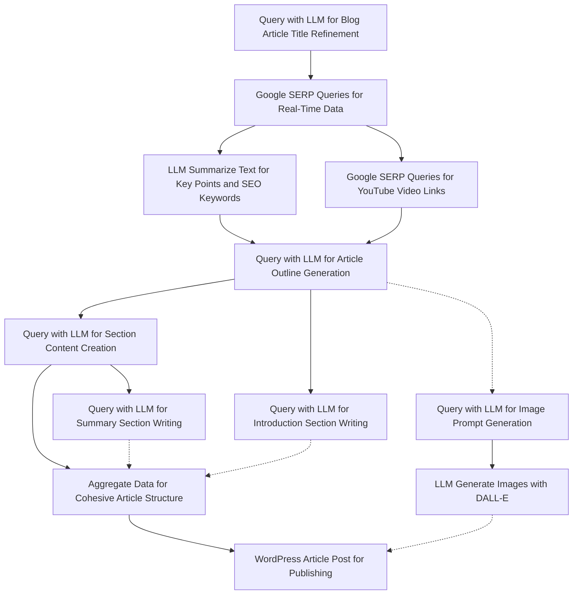

# BurstyAI Blog Article Writer Workflow

The BurstyAI Blog Article Writer Workflow is designed to streamline the process of creating and publishing comprehensive, SEO-optimized blog articles. Leveraging the latest advancements in AI and automation, this workflow ensures the production of high-quality content that resonates with your audience and adheres to SEO best practices.

## Key Features

1. **Real-Time Factual Data Integration**: Utilizes up-to-date, factual data as references for blog content, ensuring that the articles are informative and relevant.
2. **Multimedia Content Generation**: Automatically generates AI-created images and includes YouTube videos within the blog, enhancing reader engagement and providing a richer content experience.
3. **WordPress Integration**: Seamlessly integrates with WordPress and other webhooks for automated publishing, simplifying the content management process.
4. **Dynamic Content Linking**: Links to your company and randomly selects a product link from `company_info` and `company_products` sheets to be included in the content, providing direct pathways for readers to explore your offerings.
5. **Key Takeaways and Citations**: Generates concise key takeaway sections and comprehensive citation lists, adding value and credibility to your blog posts.
6. **Pre-execution Checks**: Ensures that `company_info` and `company_products` sheets are populated before initiating the blog creation process to maintain content quality and relevance.
7. **Preparatory Workflow Recommendation**: Recommends using the 'Keyword to Blog Article Plan' workflow as a preliminary step for enhanced blog planning and strategic content creation.

## Optional Parameters

The workflow supports several optional parameters to customize the blog creation process according to your specific needs:

- **Section Amount**: Specifies the number of sections in the blog. Default value: `7-10`.
- **Tone of Voice**: Sets the tone of voice for the article to be SEO Optimized (Confident, Knowledgeable, Neutral, and Clear). Default value: `SEO Optimized (Confident, Knowledgeable, Neutral, and Clear)`.
- **BURSTYAI_SERP_COUNTRY**: Tailors the Google search results by country code. Default value: `us`.
- **BURSTYAI_SERP_LANGUAGE**: Specifies the language for search results and article generation. Default value: `en`.
- **BURSTYAI_LLM_CHAT_MODEL**: Defines the LLM model to be used for processing queries and generating responses. Default value: `gpt-3.5-turbo-0125`.
- **BURSTYAI_WORDPRESS_POST_STATUS**: Determines the WordPress post status. Default value: `publish`.
- **BURSTYAI_WORDPRESS_URL**: The WordPress URL where the blog will be posted. Default value: `@{BURSTYAI_WORDPRESS_URL}@`.
- **BURSTYAI_WORDPRESS_USER**: The WordPress username for authentication. Default value: `@{BURSTYAI_WORDPRESS_USER}@`.
- **BURSTYAI_WORDPRESS_PASSWORD**: The WordPress application password for secure access. Default value: `@{BURSTYAI_WORDPRESS_PASSWORD}@`.

By leveraging the BurstyAI Blog Article Writer Workflow, content creators and marketers can efficiently produce and distribute high-quality, SEO-friendly blog articles that engage and inform their target audience, while also driving traffic and conversions through strategically integrated product links and multimedia content.


## Blog Article Writing Workflow
Steps:
1. Query with LLM for refining blog article titles based on initial keywords.
2. Google SERP Queries for gathering real-time data using keywords and locale settings.
3. LLM Summarize Text to process gathered data into a concise summary with key points and SEO-optimized keywords.
4. Query with LLM for generating an article outline, incorporating YouTube video links.
5. Query with LLM for content creation, writing detailed content for each article section.
6. Query with LLM for writing an engaging introduction section, including key takeaways.
7. Query with LLM for crafting a concise summary section, highlighting key points and including citations.
8. Google SERP Queries for YouTube links specifically, to include relevant video content.
9. Aggregate Data to combine content sections into a cohesive article structure.
10. WordPress Article Post to publish the complete article, including multimedia elements.
11. Query with LLM for generating image prompts for DALL-E.
12. LLM Generate Images with DALL-E based on prompts to create images for the blog post.



## API Schema

This documentation provides details on the BurstyAI Workflow API, designed for automating the generation and publication of SEO-optimized blog articles. It leverages the latest in Google search data, incorporates AI-generated images, YouTube links, and integrates specific company and product information, all while directly posting to WordPress.

### API Version

- **Version:** 1.0.0

### Base URL

- **URL:** `https://app.burstyai.com/burstyai/aiflows`
  - Description: BurstyAI workflow API server

### API Endpoints

#### Blog Article Writer

Generates and posts an SEO-optimized blog article to WordPress, utilizing Google search data, AI-generated images, YouTube links, and tailored company and product data.

- **Endpoint:** `/65e1aa9247065c0001e37a8b/execute`
- **Method:** `POST`
- **Description:** Automates the creation and posting of a blog article, ensuring SEO optimization, and inclusion of multimedia and tailored content.

##### Request Body

- **Content-Type:** `application/json`
- **Required:** Yes

###### Parameters

| Parameter                          | Type    | Description                                                                                      |
|------------------------------------|---------|--------------------------------------------------------------------------------------------------|
| `requiredParams.blog_title`        | string  | The title of the blog article.                                                                   |
| `requiredParams.blog_topic`        | string  | The main topic or subject of the blog article.                                                   |
| `optionalParams.section_amount`    | string  | Specifies the number of sections in the blog article.                                            |
| `optionalParams.tone_of_voice`     | string  | The tone of voice to be used in the article (e.g., informative, casual).                         |
| `optionalParams.BURSTYAI_SERP_COUNTRY` | string  | Country code for tailoring Google search results (e.g., "us", "uk").                             |
| `optionalParams.BURSTYAI_SERP_LANGUAGE` | string  | Language code for search results and article generation (e.g., "en", "es").                      |
| `optionalParams.BURSTYAI_LLM_CHAT_MODEL` | string  | Specifies the LLM model used for content generation.                                             |
| `optionalParams.BURSTYAI_WORDPRESS_POST_STATUS` | string  | Status of the WordPress post (e.g., "draft", "publish").                                         |
| `optionalParams.BURSTYAI_WORDPRESS_URL` | string  | The URL of the WordPress site where the article will be posted.                                  |
| `optionalParams.BURSTYAI_WORDPRESS_USER` | string  | Username for WordPress site access.                                                              |
| `optionalParams.BURSTYAI_WORDPRESS_PASSWORD` | string  | Password or application password for WordPress site access.                                      |
| `scheduler.cronExpression`         | string  | Cron expression for scheduling the workflow execution.                                           |
| `scheduler.timeZone`               | string  | User's browser timezone, must be a valid `java.util.TimeZone` ID.                                |

##### Responses

- **200 OK:** Workflow successfully initiated, returns a job execution ID.
  - `{"message": "Workflow job execution id indicating successful operation."}`
- **400 Bad Request:** Request failed due to missing or invalid parameters.
- **401 Unauthorized:** Incorrect API credentials provided.
- **500 Internal Server Error:** An error occurred in processing the request.

### Example Usage

To start the Blog Article Writer workflow, send a `POST` request to `/65e1aa9247065c0001e37a8b/execute` with the necessary JSON payload:

```json
{
  "requiredParams": {
    "blog_title": "The Future of AI in Healthcare",
    "blog_topic": "Healthcare"
  },
  "optionalParams": {
    "section_amount": "5",
    "tone_of_voice": "informative",
    "BURSTYAI_SERP_COUNTRY": "us",
    "BURSTYAI_SERP_LANGUAGE": "en",
    "BURSTYAI_LLM_CHAT_MODEL": "latest",
    "BURSTYAI_WORDPRESS_POST_STATUS": "draft",
    "BURSTYAI_WORDPRESS_URL": "https://yourwordpresssite.com",
    "BURSTYAI_WORDPRESS_USER": "admin",
    "BURSTYAI_WORDPRESS_PASSWORD": "yourpassword"
  }
}
